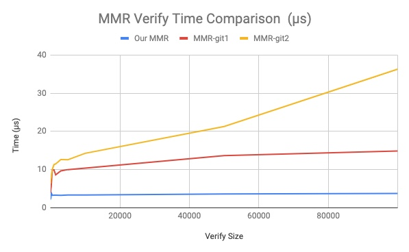

# Simple MMR implementation
## Extreme Case benchmark 

time took to construct the MMR of size 630000: 156.230914ms\
time took to get proof from the MMR of size 630000: 33.063µs\
time took to verify proof the MMR of size 630000: 2.127µs

time took for merklemountainrange to construct the MMR of size 630000: 2.04099291s\
time took for merklemountainrange to get proof from the MMR of size 630000: 45.143µs\
time took for merklemountainrange to verify proof the MMR of size 630000: 22.025µs

time took for ckb_merkle_mountain_range to construct the MMR of size 630000: 763.105765ms\
time took for ckb_merkle_mountain_range to get proof from the MMR of size 630000: 33.182519ms\
time took for ckb_merkle_mountain_range to verify proof the MMR of size 630000: 168.508µs

|  unit: us |   Our MMR  | merklemountainrange | ckb_merkle_mountain_range |
|:---------:|:----------:|:-------------------:|:-------------------------:|
| Construct | 156230.914 |      2040992.91     |         763105.765        |
|   Proof   |   33.063   |        45.143       |         33182.519         |
|   Verify  |    2.127   |        22.025       |          168.508          |

## More benchmarks

### Data

 unit: us

| construction  |           |            |           |   | proof         |         |          |          |   | verify        |         |          |          |
|---------------|-----------|------------|-----------|---|---------------|---------|----------|----------|---|---------------|---------|----------|----------|
| size | Our MMR   | MMR-git1   | MMR-git2  |   | size | Our MMR | MMR-git1 | MMR-git2 |   | size | Our MMR | MMR-git1 | MMR-git2 |
| 10            | 23.662    | 126.677    | 17.475    |   | 10            | 1.246   | 3.908    | 3.962    |   | 10            | 2.587   | 3.918    | 6.382    |
| 50            | 32.611    | 225.294    | 54.116    |   | 50            | 1.506   | 4.331    | 5.033    |   | 50            | 2.472   | 4.443    | 7.279    |
| 100           | 49.385    | 364.363    | 102.241   |   | 100           | 1.599   | 6.189    | 5.348    |   | 100           | 2.586   | 4.927    | 7.512    |
| 200           | 92.97     | 830.245    | 192.121   |   | 200           | 2.68    | 6.752    | 6.134    |   | 200           | 3.901   | 5.576    | 7.869    |
| 500           | 158.055   | 1804.914   | 473.45    |   | 500           | 2.399   | 7.348    | 8.854    |   | 500           | 3.276   | 9.872    | 10.043   |
| 1000          | 342.514   | 3140.373   | 944.7     |   | 1000          | 2.466   | 8.063    | 12.793   |   | 1000          | 3.312   | 9.932    | 11.327   |
| 1500          | 460.005   | 4506.69    | 1516.464  |   | 1500          | 2.755   | 9.772    | 15.494   |   | 1500          | 3.328   | 8.636    | 11.494   |
| 3000          | 847.845   | 8950.465   | 2860.754  |   | 3000          | 2.907   | 10.677   | 23.253   |   | 3000          | 3.253   | 9.665    | 12.611   |
| 5000          | 1515.466  | 15042.888  | 4863.463  |   | 5000          | 2.343   | 11.213   | 32.33    |   | 5000          | 3.332   | 10.005   | 12.564   |
| 10000         | 3080.699  | 30022.835  | 9774.028  |   | 10000         | 2.241   | 11.823   | 97.631   |   | 10000         | 3.373   | 10.378   | 14.262   |
| 50000         | 13756.352 | 139398.472 | 43675.006 |   | 50000         | 4.367   | 12.961   | 458.627  |   | 50000         | 3.599   | 13.639   | 21.259   |
| 100000        | 26423.504 | 278545.354 | 84472.875 |   | 100000        | 18.061  | 22.398   | 1239.555 |   | 100000        | 3.753   | 14.874   | 36.3     |

### Graphs

